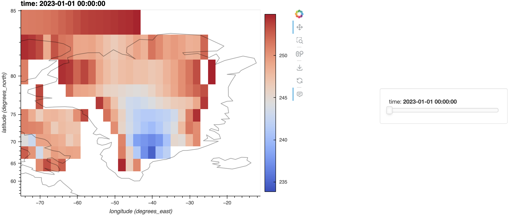

# iharp-pure-query

HTML preview: https://html-preview.github.io/?url=https://github.com/iharp2/iharp-pure-query/blob/main/src/example.html

Run `init_venv.sh` to initialize virtual environment and install packages. 
```bash
bash init_venv.sh
```

To run the query examples, open jupyter notebook `src/example.ipynb` and run all cells. 

To run tests, run `pytest` in terminal. 
```bash
pytest
```

## Roadmap

| Query                              |    Single File     |    Multi Files     | Files + API | pre-aggregation | pre-aggregation + API |
| ---------------------------------- | :----------------: | :----------------: | :---------: | :-------------: | :-------------------: |
| single value aggregation           | :white_check_mark: | :white_check_mark: |             |                 |                       |
| time series aggregation            | :white_check_mark: | :white_check_mark: |             |                 |                       |
| heatmap aggregation (single layer) | :white_check_mark: | :white_check_mark: |             |                 |                       |
| heatmap aggregation (multi layer)  | :white_check_mark: | :white_check_mark: |             |                 |                       |
| value-criteria query               | :white_check_mark: | :white_check_mark: |             |                 |                       |
| arbitrary shape query              | :white_check_mark: | :white_check_mark: |             |                 |                       |
| time period finding                | :white_check_mark: | :white_check_mark: |             |                 |                       |
| area finding                       | :white_check_mark: | :white_check_mark: |             |                 |                       |

## Example
| Query                              |               Single File                |
| ---------------------------------- | :--------------------------------------: |
| single value aggregation           |     |
| time series aggregation            |          |
| heatmap aggregation (single layer) |   .png)   |
| heatmap aggregation (multi layer)  |   .png)    |
| value-criteria query               |       |
| arbitrary shape query              |      |
| time period finding                |  |
| area finding                       |         |
